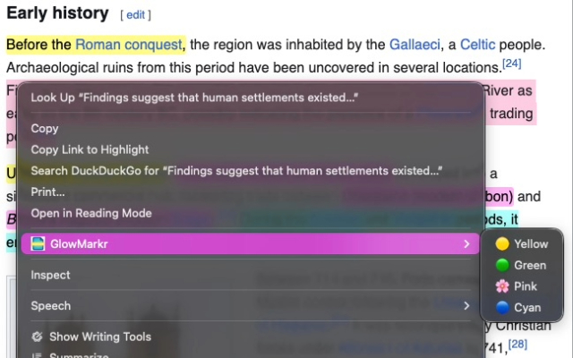
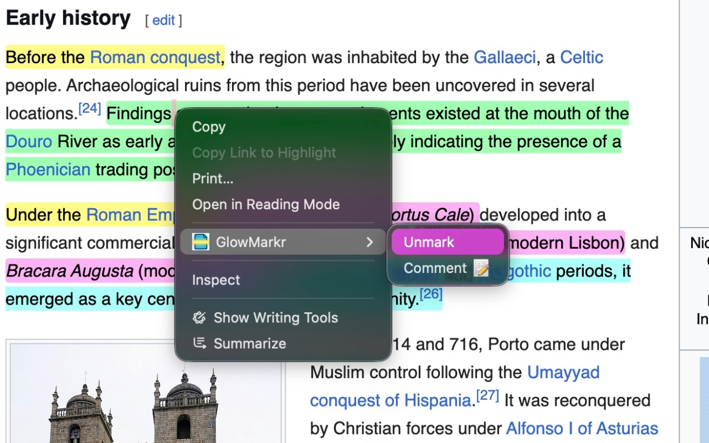

# ✨ GlowMarkr: Your Digital Highlighter ✨

  

Ever wish you could highlight stuff on websites and have it *actually* stay there? Like, forever? Meet **GlowMarkr**, your new bestie for studying, research, or just remembering that hilarious meme you saw. 📝

## 🤔 So, what's the tea?

GlowMarkr lets you highlight text on any webpage, and it magically remembers your highlights next time you visit. No more losing your spot or taking a million screenshots. It's like having digital sticky notes that never fall off. 📌

## 🚀 How to use it

**To add a highlight:**

1.  **Select text:** Just drag your mouse over anything you want to remember.
2.  **Right-click:** A menu will pop up.
3.  **Choose your color:** Select one of the color options (e.g., "🟡 Yellow", "🟢 Green", "🌸 Pink", "🔵 Cyan"). Your text is highlighted in the chosen color! 💥

  

**To remove a highlight:**

Changed your mind? No problem!

1.  **Select the highlight:** Drag your mouse over the highlighted text you wish to remove.
2.  **Right-click:** Open that same menu.
3.  **Click "Unmark":** The highlight will disappear. ✨

  

## 🧠 It just *knows*

The next time you open that page, GlowMarkr will automatically re-apply your highlights. It's perfect for:

*   **Studying:** Keep track of key points in online articles.
*   **Shopping:** Highlight features of products you're comparing.
*   **Reading:** Mark your favorite quotes or important passages.

## 💖 Why you'll love it

*   **Super simple:** No complicated settings or buttons.
*   **It's persistent:** Your highlights are saved automatically and are there when you come back.
*   **It's free!**

## ⚠️ A Quick Heads-Up

GlowMarkr works best on pages with static content, like articles, blog posts, and documentation.

However, it may not work as expected on highly dynamic websites where the content changes frequently or is loaded on the fly. For example, on websites like **Facebook**, **Gmail**, or **Reddit**, you might find that your highlights don't reappear consistently.

## ⭐ Your Feedback Matters! ⭐

If you find GlowMarkr useful, please consider giving it a 5-star rating on the [Chrome Web Store](https://chromewebstore.google.com/detail/glowmarkr/nklngngbaglejehlcaffjgheakcalhil)! Your support helps us grow and improve.

Encounter a bug? Before leaving a low rating, please [open an issue](https://github.com/davidraviv/chrome-glowmarkr/issues/new/choose) on our GitHub page. We're committed to making GlowMarkr better, and your feedback is crucial for that.

Happy highlighting! Highlighter fam! 🎉
