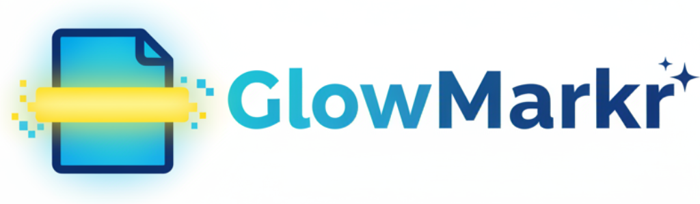

# ✨ GlowMarkr: Your Digital Highlighter ✨

  

Ever wish you could highlight stuff on websites and have it *actually* stay there? Like, forever? Meet **GlowMarkr**, your new bestie for studying, research, or just remembering that hilarious meme you saw. 📝

## 🤔 So, what's the tea?

GlowMarkr lets you highlight text on any webpage, and it magically remembers your highlights next time you visit. No more losing your spot or taking a million screenshots. It's like having digital sticky notes that never fall off. 📌

## 🚀 How to use it

**To add a highlight:**

1.  **Select text:** Just drag your mouse over anything you want to remember.
2.  **Right-click:** A menu will pop up.
3.  **Click "GlowMarkr":** And boom! Your text is highlighted in a sunny yellow. 💥

**To remove a highlight:**

Changed your mind? No problem!

1.  **Select the highlight:** Drag your mouse over the highlighted text.
2.  **Right-click:** Open that same menu.
3.  **Click "GlowMarkr" again:** The highlight will disappear. ✨

It's a simple toggle—click to glow, click again to let go!

## 🧠 It just *knows*

The next time you open that page, GlowMarkr will automatically re-apply your highlights. It's perfect for:

*   **Studying:** Keep track of key points in online articles.
*   **Shopping:** Highlight features of products you're comparing.
*   **Reading:** Mark your favorite quotes or important passages.

## 💖 Why you'll love it

*   **Super simple:** No complicated settings or buttons.
*   **It's persistent:** Your highlights are saved automatically and are there when you come back.
*   **It's free!**

Happy highlighting! Highlighter fam! 🎉
